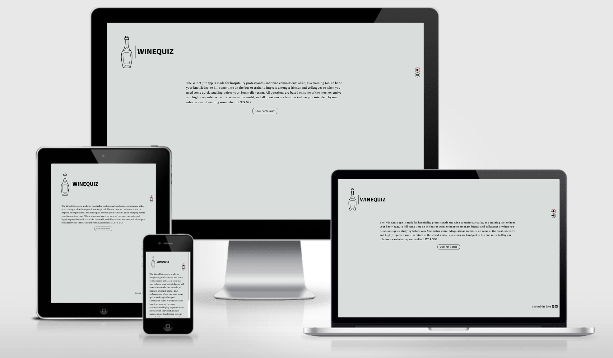

# WineQuiz

This JavaScript winequiz designed to be just as fun by your self as it will be in a group, and is made with hospitality professionals in mind. The questions will be suited for professionals and beginners alike. The app is designed to help hospitality workers and wine enthusiasts expand their wine knowledge in an easy and interactive way, all questions are controlled by a award-winning Sommelier and based on the best wine literature available.

## Demo

Link to the live site: https://mareliusmoen.github.io/winequiz/
## User Stories
This app is created for those industry professionals or wine enthusiasts that have a basic/intermidiate knowledge about wine, wine regions, production technique and would like to learn more while testing their skills.
As a user of this quiz I would like to:
- As a user, I want to quickly understand what the quiz is all about and how to start to quiz itself.
- As a user, I want to be able to play the quiz on laptop/desktop (mouse), tablet (touchscreen) and mobile (touchscreen).
- As a user, I would like to know my score as I play the game.
- As a user, I would like to get the correct shown when I answer incorrectly to learn more about the subject.
- As a user, I would like to have a way to share the Quiz the quiz URL with friends & family through social media(Facebook and Linkedin).
- As a user I can keep on playing and learning without the quiz ending.
- As a user it should be quick to start a new game so it's always practical to just do a few quistions whenever I have some spare time.

## Strategy
The strategy is to educate people about wine, bring more enthusiasm to the subject of wine and do it in a fun and creative way. This will also be a great training tool for employees in the hospitality industry as well as those doing their Sommelier certifications.

## Wireframe
The wireframe for this project was hand written as I enjoy the artist freedom and creativity the process gives me, then those handwritten designs were digitalised with the AI-powered Uizasrd App ( app.uizard.io ).
Because of feedback from test users and extensive testing by myself, I have excluded the extra correct/wrong answer pages, to enhance the swiftness of the app and to boost the productivity of the learning experience of the user, I have instead incorporated this in coloring the different option after the user have selected their answer (green for correct and red for wrong). In addition to the color change I've added sound effects(bottle pop sounf for correct and bottle breaking for wrong). The timer/countdown was removed to allow for the app be more educational rather than a test to assert your current knowledge, so now the user can read the question and all the answer at their own pace and contemplate about the facts presented by each individual question.

### Welcome screen

### Question screen

### Correct answer

### Wrong answer

### Color scheme
Pearl river #D9DDDC for background & charcoal #222021 for text & borders.
For the correct- and wrong answer buttons aswell as unmute- and mute-butten the colors #81996750 & #ff9b9b50 are used.

## Technologies
- HTML - To create a basic site
- JavaScript - To create the Quiz itself
- CSS - To style the site and quiz to make it accessible and nice to look at
- Uizard - To create the wireframes

## Excisting features
The features of the page where slightly changes from the original wireframe because of the strategy and goal of this app, to educate in a fun and creative way, and then the correct answer screens would be a distraction and make the user experience more tidious and less smooth.

The app has:
- A welcome text that is descriptive, fun/easy-going and entices the user to click the start-button.
- It has a start-button that hides the welcometext and brings out the first question with 2-4 answer options.
- Mute and Unmute buttons that show a color when active (red for mute, green for unmute), the default for the page is mute.
- When an answer is selected by touch or click the selected answer gets a extra thick border and the correct answer turns green and all the incorrect answers turns red. If you chose correctly the score-counter increases by 1, and as soon as you have selected your option a next question button will appear. (If there are no more questions available in the index a endgame/ restart button will show up)
- In addition to the thicker border and colorchange, if unmuted, the user will hear a sound confirming of the answer was correct(bottle popping sound) or wrong (bottle shattering sound).
- The WineQuiz logo is also a reset link that brings you back to the welcomepage and resets your score.

## Features left to implement
- Share-links for Facebook and LinkedIn are not functioning.

## Testing
- I've tested the app and it works as intended in these browsers: Microsoft Edge, Firefox, Chrome and Safari.
- Its tested on a Samsung S20 in chrome browser, and a Iphone 14 MAX in safari browser.
- Through the devtools device toolbar I have confirmed the responsiveness of the app for screensizes from small mobile screens all the way to 4K displays.
- Confirmed that the mute and unmute buttons function properly, and functions properly on different devices (Samsung S20, Iphone 14 Max, Macbook Pro, Windows 10 laptop).
- I confirmed that the logo link resets and restart the game, and brings the user back to the welcome message and resets score.

## Validator testing
- HTML, no errors or warnings when run through the official W3C validator.
- CSS, no errors or warnings when run through the official W3C validator (jigsaw).
- 

## Bugs
- Mute/ unmute buttons did not function as intended, would unmute when pressed but not go back mute when pressed again. The fix was to change the '=' sign in the function to a absolute equality '==='.
- Problems with the score not increasing everytime you press the correct button (you can press it ten times for 10 points before moving on to the next question). The fix was to deactivate the answerbuttons after any of them were pressed once.

## Unsolved bugs
????

## Deployment
This site was deployed to GitHub Pages and this is the method I used: From the GitHub repository go to the settings, in the source-section dropdown menu select master branch. Once the master branch has been selected, the page will be automatically refreshed with a detailed ribbon display to indicate the successful deployment.

## Credits
- Logo created at www.looka.com .
- Main layout inspired by: 
    - https://stackoverflow.com/questions/52196711/generate-a-score-based-on-correct-answers
    - https://www.codingninjas.com/studio/library/how-to-create-a-quiz-app-using-javascript
    - https://www.sitepoint.com/simple-javascript-quiz/
    - https://www.youtube.com/watch?v=_Im_xc_jMnk
    - https://www.youtube.com/watch?v=riDzcEQbX6k
- addEventListener and appendChild elements
    - https://www.w3schools.com/jsref/met_element_addeventlistener.asp
    - https://www.w3schools.com/jsref/met_node_appendchild.asp
- Question-randomization explained and credited from: https://forum.freecodecamp.org/t/how-does-math-random-work-to-sort-an-array/151540
- Answer buttons function inside the showQuestion function is credited to both:
https://stackoverflow.com/questions/72873577/creating-a-javascript-quiz-web-app-why-wont-the-answer-options-show-under-each &
https://www.youtube.com/watch?v=riDzcEQbX6k
- Adding color to buttons when pressed and with correct/wrong answer: https://www.geeksforgeeks.org/how-to-change-the-background-color-after-clicking-the-button-in-javascript/
- Adding sound files to the correct answer button and wrong answer button:
https://noaheakin.medium.com/adding-sound-to-your-js-web-app-f6a0ca728984
- How to add toggle boolean to mute buttons: https://www.tutorialspoint.com/how-to-toggle-a-boolean-using-javascript
- Some initial bugs where sorted with the assistance of this page: https://stackoverflow.com/questions/72873577/creating-a-javascript-quiz-web-app-why-wont-the-answer-options-show-under-each
### Media
- Sound files for correct and wrong answer, David Calikes
- All icons from https://fontawesome.com/

