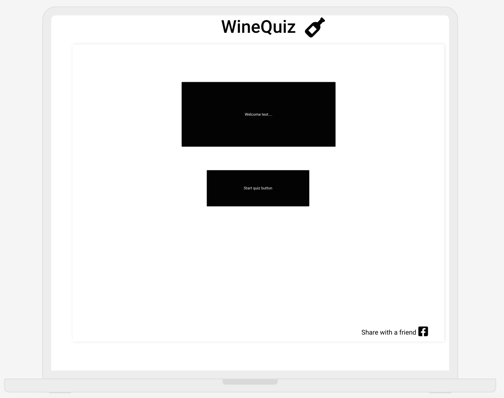
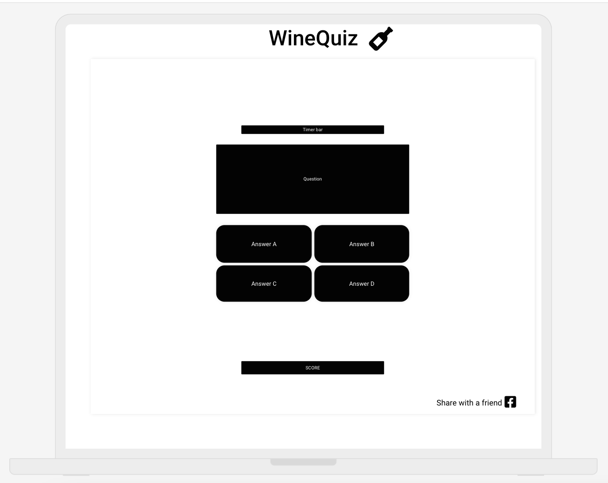
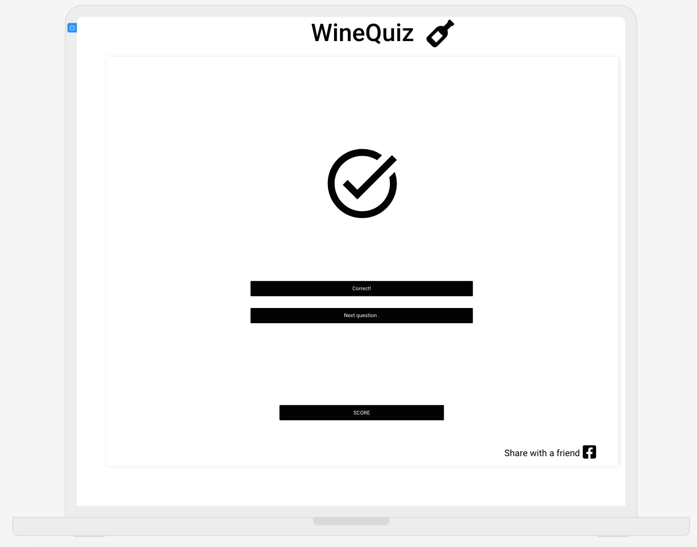
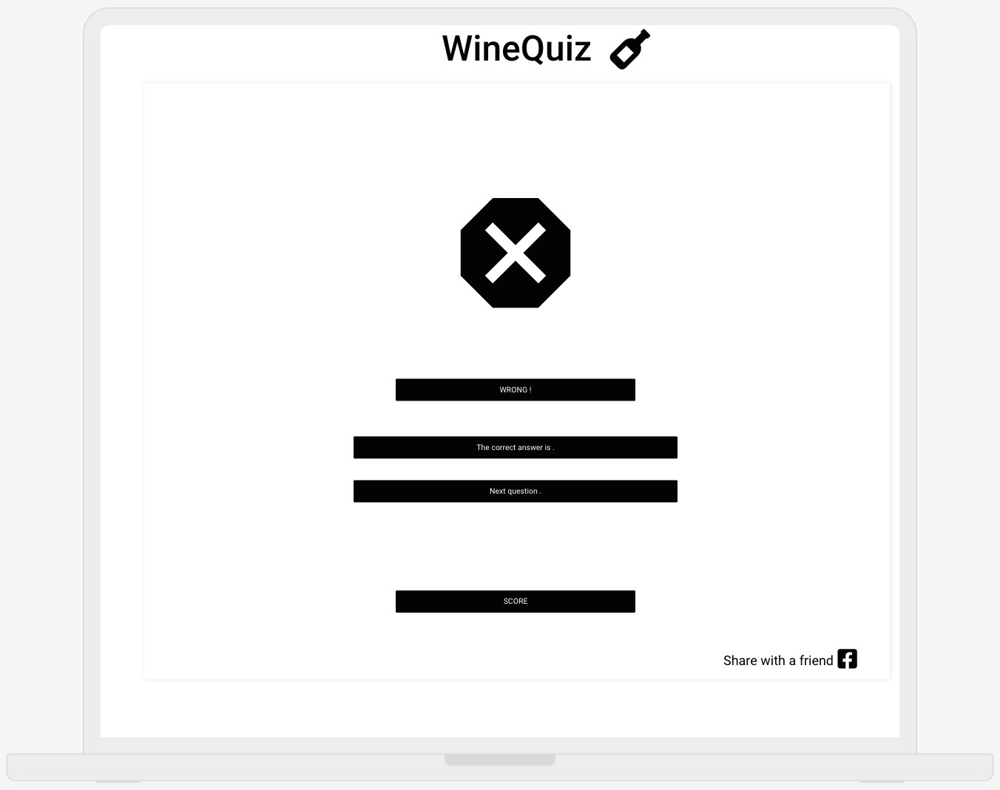

# WineQuiz

This a JavaScript winequiz designed to be just as fun by your self as it will be in a group, the quistions will be suited for a beginner level and are controlled by a award-winning Sommelier.

## Demo
add responsiveness picture here

## User Stories
This app is created for those that have a basic knowledge about wine, wine regions, production technique and would like to learn more while testing their skills.
As a user of this quiz I would like to:
- As a user, I want to quickly understand what the quiz is all about and how to start to quiz itself.
- As a user, I want to be able to play the quiz on laptop/desktop (mouse), tablet (touchscreen) and mobile (touchscreen).
- As a user, I would like to know my score as I play the game.
- As a user, I would like to get the correct answered explained when I answer incorrectly to learn more about the subject.
- As a user, I would like to have a way to share the Quiz the quiz URL with friends & family through social media(Facebook,Instagram and email).

## Strategy
The strategy is to educate people about wine knowledge, bring more enthusiasm to the subject of wine and do it in a fun and creative way. This will also be a great training tool for employees in the hospitality industry as well as those doing their Sommelier certifications.

## Wireframe
The wireframe for this project was hand written as I enjoy the artist freedom and creativity the process gives me, then those handwritten designs were digitalised with the AI-powered Uizasrd App ( app.uizard.io ).

### Welcome screen

### Question screen

### Correct answer

### Wrong answer

### Color scheme
Pearl river #D9DDDC for background & charcoal #222021 for text & borders.

## Technologies
- HTML - To create a basic site
- JavaScript - To create the Quiz itself
- CSS - To style the site and quiz to make it accessible and nice to look at
- Uizard - To create the wireframes

## Excisting features
The features of the page where slightly changes from the original wireframe because of the strategy and goal of this app, to educate in a fun and creative way, and then the correct answer screens would be a distraction and make the user experience more tidious and less smooth.

The app has:
- A welcome text that is descriptive, fun/easy-going and entices the user to click the start-button.
- It has a start-button that hides the welcometext and brings out the first question with 2-4 answer options.
- When an answer is selected by touch or click the selected answer gets a extra thick border and the correct answer turns green and all the incorrect answers turns red. If you chose correctly the score-counter increases by 1, and as soon as you have selected your option a next question button will appear. (If there are no more questions available in the index a endgame/ restart button will show up)
## Features left to implement
????

## Testing
????
## Validator testing
?????

## Bugs
????
## Unsolved bugs
????

## Deployment
????

## Credits
- Logo created at www.looka.com .
- Main layout inspired by: 
    - https://www.codingninjas.com/studio/library/how-to-create-a-quiz-app-using-javascript
    - https://www.sitepoint.com/simple-javascript-quiz/
    - https://www.youtube.com/watch?v=_Im_xc_jMnk
    - https://www.youtube.com/watch?v=riDzcEQbX6k
- Question-randomization explained and credited from: https://forum.freecodecamp.org/t/how-does-math-random-work-to-sort-an-array/151540
- Answer buttons function inside the showQuestion function is credited to both:
https://stackoverflow.com/questions/72873577/creating-a-javascript-quiz-web-app-why-wont-the-answer-options-show-under-each &
https://www.youtube.com/watch?v=riDzcEQbX6k